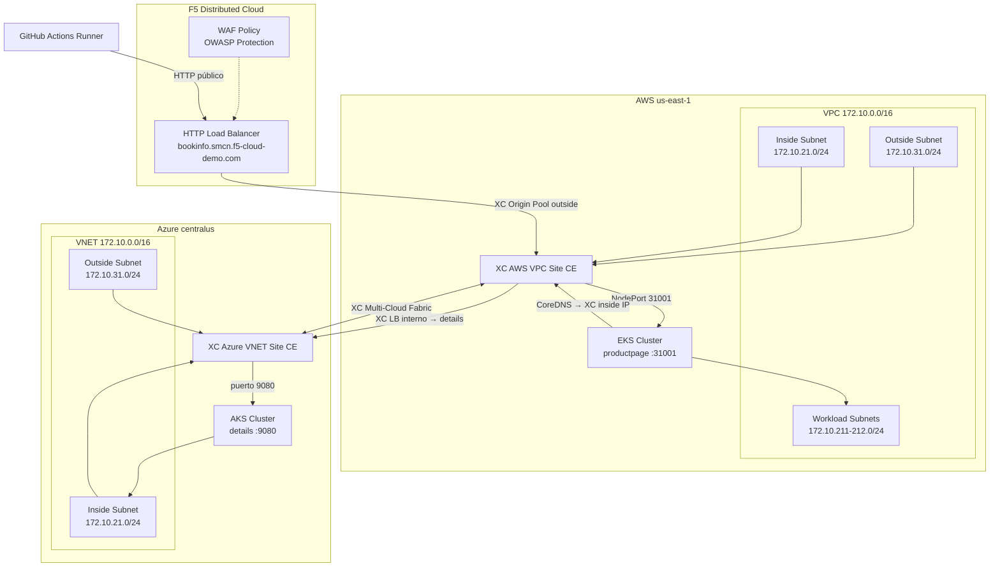

# Bookinfo Secure MCN Apply

Este documento describe el workflow de GitHub Actions:

- `.github/workflows/bookinfo-smcn-apply.yaml`

Su objetivo es desplegar y validar el escenario **Secure Multi-Cloud Networking (SMCN)** con la aplicación Bookinfo distribuida entre AWS (EKS) y Azure (AKS), usando Terraform Cloud, F5 Distributed Cloud (XC) como plano de conectividad, y WAF como capa de seguridad de aplicaciones.

---

## Resumen de arquitectura y caso de uso

### ¿Para qué sirve este laboratorio?

Este laboratorio implementa un escenario de **aplicación distribuida multi-cloud** donde los microservicios de Bookinfo se ejecutan en dos clusters Kubernetes en nubes distintas (EKS en AWS y AKS en Azure), conectados y expuestos de forma segura a través de **F5 Distributed Cloud**. Cubre tres capacidades clave:

| Capacidad                          | Descripción                                                                                                                                                                       |
| ---------------------------------- | --------------------------------------------------------------------------------------------------------------------------------------------------------------------------------- |
| **Conectividad multi-cloud**       | Conecta EKS (AWS) y AKS (Azure) a través de XC Sites, permitiendo que los microservicios se comuniquen entre nubes sin VPNs tradicionales ni peering directo.                     |
| **App Delivery con XC LB**         | Expone la aplicación Bookinfo mediante HTTP Load Balancers de F5 XC, balanceando tráfico hacia los namespaces de ambos clusters con resolución de nombres desacoplada de la nube. |
| **Web Application Firewall (WAF)** | Aplica políticas WAF de XC sobre los Load Balancers de Bookinfo, bloqueando ataques XSS, SQLi y otras amenazas OWASP directamente en el plano de distribusión de F5 XC.           |

### Arquitectura conceptual

```
┌───────────────────────────────────────────────────────────────────────────────┐
│                          F5 Distributed Cloud (XC)                            │
│                                                                                │
│   ┌──────────────────────────────────────────────────────────────────────┐    │
│   │     XC HTTP LB Público: bookinfo.smcn.f5-cloud-demo.com (+ WAF)      │    │
│   │     Origin Pool → AWS Site (outside) → productpage en EKS            │    │
│   └────────────────────┬─────────────────────────────────────────────────┘    │
│                         │                                                      │
│   ┌─────────────────────┴────────────────────────────────────────────────┐    │
│   │     XC HTTP LB Interno: details_domain (solo inside AWS Site)        │    │
│   │     Origin Pool → Azure Site (inside) → details en AKS              │    │
│   └────────────────────┬────────────────────────┬────────────────────────┘    │
└────────────────────────┼────────────────────────┼─────────────────────────────┘
                         │ XC Origin Pool (outside) │ XC Origin Pool (inside)
          ┌──────────────▼──────────┐    ┌──────────▼────────────┐
          │      AWS VPC Site       │    │    Azure VNET Site     │
          │   (Customer Edge CE)    │    │   (Customer Edge CE)   │
          │                         │    │                        │
          │  VPC 172.10.0.0/16      │    │  VNET 172.10.0.0/16    │
          │  ├─ Outside (WAN)       │    │  ├─ Outside (WAN)      │
          │  ├─ Inside  (LAN)       │    │  ├─ Inside  (LAN)      │
          │  └─ EKS Cluster         │    │  └─ AKS Cluster        │
          │     (us-east-1)         │    │     (centralus)        │
          │     └─ productpage ─────┼────┼──► details             │
          │        (NodePort 31001) │    │   (puerto 9080)        │
          └─────────────────────────┘    └────────────────────────┘
                   Llamada interna: productpage → details via XC LB interno
                   (CoreDNS en EKS resuelve details_domain → XC inside IP)
```

### Casos de uso típicos

1. **Aplicaciones distribuidas entre nubes con un único punto de entrada**
   Empresas que distribuyen microservicios entre AWS y Azure pueden usar XC como capa de entrega unificada, con un FQDN único para exponer la aplicación sin importar en qué nube viven los backends.

2. **Protección WAF centralizada multi-cloud**
   Aplicar una política WAF consistente sobre todos los microservicios expuestos desde múltiples nubes, sin gestionar WAFs independientes por proveedor. XC aplica la misma política OWASP independientemente de si el backend está en EKS o AKS.

3. **Migración progresiva de carga entre clusters**
   Permite desplazar progresivamente el tráfico de un cluster a otro mediante la configuración de los Origin Pools de XC, sin cambios en DNS externo ni en la configuración del cliente.

4. **Laboratorio de aprendizaje / PoC**
   Valida en un entorno automatizado y reproducible cómo XC conecta clusters Kubernetes en nubes distintas, expone servicios y aplica seguridad de nivel aplicativo (L7).

### Componentes desplegados por opción de deployment

```
azure-vnet-site   →  Red Azure + Credenciales XC + CE Azure
aws-vpc-site      →  Red AWS   + Credenciales XC + CE AWS
deploy-workloads  →  Todo lo anterior + EKS + AKS + Bookinfo + XC LB
enable-waf        →  Todo lo anterior + WAF policy en LBs + pruebas de bloqueo
```

---

## Objetivo del workflow

El workflow orquesta, según la opción seleccionada:

1. Aplicación de variables de entorno comunes para todos los jobs.
2. Aprovisionamiento de networking y credenciales cloud en AWS y/o Azure.
3. Creación/actualización de sitios XC (AWS VPC Site / Azure VNET Site).
4. Creación de clusters Kubernetes (EKS en AWS, AKS en Azure).
5. Despliegue de la aplicación Bookinfo y configuración de XC Load Balancers.
6. (Opcional) Aplicación de política WAF sobre los Load Balancers y validación de bloqueo.

## Triggers

- `workflow_dispatch`
  - Permite ejecución manual desde GitHub.
  - Inputs:
    - `deployment` (choice):
      - `azure-vnet-site`
      - `aws-vpc-site`
      - `deploy-workloads`
      - `enable-waf`
    - `TF_VAR_prefix` (string, opcional)

- `workflow_call`
  - Permite invocación desde otros workflows.
  - Inputs:
    - `deployment`
    - `TF_VAR_prefix` (opcional)

## Secretos requeridos

### Terraform / XC

| Secret                  | Descripción                                |
| ----------------------- | ------------------------------------------ |
| `TF_CLOUD_ORGANIZATION` | Organización en Terraform Cloud            |
| `TF_API_TOKEN`          | Token de API de Terraform Cloud            |
| `XC_API_URL`            | URL de la API de F5 XC                     |
| `XC_P12_PASSWORD`       | Contraseña del certificado P12 de XC       |
| `XC_API_P12_FILE`       | Certificado P12 de XC codificado en base64 |

### AWS

| Secret                          | Descripción                                   |
| ------------------------------- | --------------------------------------------- |
| `AWS_ACCESS_KEY`                | Access Key ID de AWS                          |
| `AWS_SECRET_KEY`                | Secret Access Key de AWS                      |
| `AWS_SESSION_TOKEN`             | Session Token de AWS (si se usa rol temporal) |
| `XC_AWS_CLOUD_CREDENTIALS_NAME` | Nombre de las credenciales AWS en XC          |

### Azure

| Secret                            | Descripción                                                                        |
| --------------------------------- | ---------------------------------------------------------------------------------- |
| `AZURE_SUBSCRIPTION_ID`           | ID de la suscripción Azure                                                         |
| `AZURE_TENANT_ID`                 | ID del tenant Azure                                                                |
| `AZURE_CLIENT_ID`                 | App ID del Service Principal de Terraform                                          |
| `AZURE_CLIENT_SECRET`             | Secret del Service Principal de Terraform                                          |
| `AZURE_CLIENT_OBJECT_ID`          | Object ID del Service Principal de Terraform (necesario para asignar roles en AKS) |
| `AZURE_OWNER_CLIENT_ID`           | App ID del Service Principal con rol Owner (para crear role assignments)           |
| `AZURE_OWNER_CLIENT_SECRET`       | Secret del Service Principal con rol Owner                                         |
| `XC_AZURE_CLOUD_CREDENTIALS_NAME` | Nombre de las credenciales Azure en XC                                             |

> **Nota sobre `AZURE_OWNER_CLIENT_ID` y `AZURE_OWNER_CLIENT_SECRET`:**
> El SP de Terraform (`AZURE_CLIENT_ID`) necesita el rol `User Access Administrator` sobre el Resource Group para poder crear las `azurerm_role_assignment` que el AKS cluster requiere. Dado que el SP de Terraform generalmente no tiene ese permiso por sí mismo, el workflow usa un SP diferente con rol Owner para otorgárselo antes del `terraform apply`.
>
> Para crear el SP Owner:
>
> ```bash
> az ad sp create-for-rbac \
>   --name "sp-workflow-owner" \
>   --role Owner \
>   --scopes "/subscriptions/<SUBSCRIPTION_ID>"
> ```

## Jobs principales

### `apply_variables`

Aplica variables base del laboratorio y exporta todos los outputs necesarios para los jobs dependientes. Valores clave configurados:

| Variable                 | Valor por defecto                 |
| ------------------------ | --------------------------------- |
| `TF_VAR_name`            | `secure-mcn`                      |
| `TF_VAR_aws_region`      | `us-east-1`                       |
| `TF_VAR_azure_location`  | `centralus`                       |
| `TF_VAR_aws_vpc_cidr`    | `172.10.0.0/16`                   |
| `TF_VAR_azure_vnet_cidr` | `172.10.0.0/16`                   |
| `TF_VAR_app_domain`      | `bookinfo.smcn.f5-cloud-demo.com` |

### `aws_credentials`, `aws_networking`, `aws_vpc_site`

Flujo completo de aprovisionamiento en AWS:

- **`aws_credentials`** — registra credenciales AWS en F5 XC.
- **`aws_networking`** — crea VPC, subredes (inside, outside, workload) y security groups en `us-east-1`.
- **`aws_vpc_site`** — despliega el Customer Edge (CE) de XC en la VPC de AWS como `ingress_egress_gw`.

### `azure_networking`, `azure_credentials`, `azure_vnet_site`

Flujo completo de aprovisionamiento en Azure:

- **`azure_credentials`** — registra credenciales Azure en F5 XC.
- **`azure_networking`** — crea VNET, subredes (inside, outside) y route tables en `centralus`.
- **`azure_vnet_site`** — despliega el Customer Edge (CE) de XC en la VNET de Azure como `ingress_egress_gw`.

### `aws_eks`

Crea el cluster EKS en AWS usando las subredes y VPC del job `aws_networking`. Outputs:

- `cluster_name`, `cluster_endpoint`, `cluster_id`, `kubeconfig`

> **Microservicio desplegado en EKS:** `productpage` (NodePort 31001)  
> Es el frontend de Bookinfo. Llama internamente al servicio `details` a través de XC: CoreDNS en EKS resuelve `details_domain` hacia la IP inside del XC CE en AWS, que enruta la petición al LB interno de XC hacia AKS en Azure.

### `azure_aks`

Crea el cluster AKS en Azure usando las subredes del job `azure_networking`.  
Incluye un step previo al `terraform apply` que:

1. Hace login con el SP Owner (`AZURE_OWNER_CLIENT_ID`)
2. Asigna `User Access Administrator` al SP de Terraform en el Resource Group `secure-mcn`
3. Espera 120 segundos para propagación de IAM antes de continuar

Outputs: `cluster_name`, `cluster_endpoint`

> **Microservicio desplegado en AKS:** `details` (puerto 9080)  
> Sirve la información detallada del libro (autor, páginas, tipo). Es consumido exclusivamente por `productpage` en EKS a través del LB interno de XC, nunca de forma directa desde internet.

> **Nota:** Los microservicios `reviews` y `ratings` de la aplicación Bookinfo **no se despliegan** en este escenario. El foco del laboratorio es demostrar la comunicación inter-cloud entre exactamente dos microservicios en nubes distintas.

### `workload`

Despliega la aplicación Bookinfo en ambos clusters y configura los HTTP Load Balancers en XC. Requiere que todos los jobs anteriores (`aws_vpc_site`, `azure_vnet_site`, `aws_eks`, `azure_aks`) hayan completado exitosamente. Outputs:

- `product_domain`, `details_domain`
- `product_loadbalancer_name`, `details_loadbalancer_name`
- `xc_namespace`, `aws_xc_node_outside_ip`

### `enable_waf_product`, `enable_waf_details`

Solo para `deployment: enable-waf`. Aplica una política WAF de F5 XC sobre los Load Balancers de Bookinfo Product y Details usando el workflow reutilizable `apply-waf-policy.yaml`.

### `test_waf`

Solo para `deployment: enable-waf`. Ejecuta tres pruebas HTTP para validar la implementación:

| Prueba                  | URL                                      | Resultado esperado                                |
| ----------------------- | ---------------------------------------- | ------------------------------------------------- |
| Conectividad Product LB | `http://<domain>/`                       | HTTP 200, página Bookinfo                         |
| Página de producto      | `http://<domain>/productpage?u=normal`   | HTTP 200, página carga con sección details activa |
| Ataque XSS              | `http://<domain>?a=<script>...</script>` | HTTP 403, bloqueado por WAF                       |

> **Nota:** `reviews` y `ratings` no están desplegados en este escenario, por lo que la sección de reseñas de la página puede mostrarse vacía o con error. Esto es esperado.

## Arquitectura desplegada por el workflow



### Rol de las subredes en la topología

| Subred                   | Propósito principal                                      | Uso en este laboratorio                                |
| ------------------------ | -------------------------------------------------------- | ------------------------------------------------------ |
| `outside subnet`         | Lado WAN/upstream del CE (conectividad externa hacia XC) | Permite que el CE establezca el Site Link con F5 XC.   |
| `inside subnet`          | Lado LAN/downstream del CE                               | Conecta el CE con los pods de los clusters EKS/AKS.    |
| `workload subnets` (AWS) | Segmentos de trabajo para los nodos EKS                  | Alojan los nodos del cluster EKS en dos AZs distintas. |

## Pruebas manuales desde navegador

Una vez que el workflow haya terminado correctamente, puedes validar manualmente la implementación:

### 1. Verificar que la app funciona

```
http://bookinfo.smcn.f5-cloud-demo.com/productpage
```

Debes ver la página de Bookinfo con reseñas y ratings cargados desde distintos microservicios.

### 2. Verificar que el WAF bloquea XSS

```
http://bookinfo.smcn.f5-cloud-demo.com/productpage?a=<script>alert('XSS')</script>
```

Debe devolver un **HTTP 403** con página de bloqueo de F5 XC.

### 3. Verificar que el WAF bloquea SQLi

```
http://bookinfo.smcn.f5-cloud-demo.com/productpage?id=1' OR '1'='1
```

También debe ser bloqueado con HTTP 403.

### Interpretación de resultados

| Lo que ves                                 | Significa                   |
| ------------------------------------------ | --------------------------- |
| Página carga con estrellas y reseñas       | MCN y LB funcionando ✅     |
| XSS/SQLi devuelve 403 con Support ID de F5 | WAF activo ✅               |
| XSS/SQLi devuelve la app normal            | WAF no activo ❌            |
| Página no carga                            | Problema de conectividad ❌ |

### Pruebas desde curl

```bash
DOMAIN="bookinfo.smcn.f5-cloud-demo.com"
XC_NODE_IP="<valor de aws_xc_node_outside_ip del output del job workload>"
UA="Mozilla/5.0 (Windows NT 10.0; Win64; x64) AppleWebKit/537.36"

# Test de conectividad normal
curl -s -H "user-agent: $UA" \
  --resolve "$DOMAIN:80:$XC_NODE_IP" \
  "http://$DOMAIN/productpage?u=normal"

# Test WAF - debe retornar 403
curl -s -H "user-agent: $UA" \
  --resolve "$DOMAIN:80:$XC_NODE_IP" \
  "http://$DOMAIN?a=<script>alert('XSS')</script>"
```

> El valor de `aws_xc_node_outside_ip` se imprime en el step **Print output vars** del job `workload` en el log del workflow.

## Ejecución manual

1. Ir a **Actions** en GitHub.
2. Seleccionar workflow: **Secure Multi-Cloud Networking Apply**.
3. Ejecutar con **Run workflow**.
4. Elegir `deployment` según el escenario:
   - `azure-vnet-site` — solo infra Azure + CE XC
   - `aws-vpc-site` — solo infra AWS + CE XC
   - `deploy-workloads` — infra completa + EKS + AKS + Bookinfo
   - `enable-waf` — todo lo anterior + WAF + pruebas
5. (Opcional) definir `TF_VAR_prefix`.

## Criterios de éxito

- Todos los jobs de aprovisionamiento terminan en estado `success`.
- En `test_waf`:
  - Respuesta HTTP 200 en endpoints normales de Bookinfo.
  - Respuesta HTTP 403 en peticiones con payloads de ataque XSS.

## Troubleshooting rápido

- **Error 403 en `azurerm_role_assignment` (`AuthorizationFailed`):**
  El SP de Terraform no tiene permisos para crear role assignments. Verificar que:
  - Los secrets `AZURE_OWNER_CLIENT_ID` y `AZURE_OWNER_CLIENT_SECRET` estén configurados.
  - El secret `AZURE_CLIENT_OBJECT_ID` corresponda al Object ID real del SP de Terraform (visible en los mensajes de error como `object id '...'`).
  - El SP Owner tenga rol `Owner` en la suscripción o al menos en el Resource Group.

- **Error `Insufficient privileges` en `az ad sp show`:**
  El SP Owner no tiene permisos de lectura en Microsoft Entra ID. Usar `AZURE_CLIENT_OBJECT_ID` directamente (ya implementado) en lugar de resolverlo dinámicamente.

- **Error de propagación IAM (`If access was recently granted, please refresh your credentials`):**
  Azure tarda hasta 2 minutos en propagar permisos IAM. El workflow agrega un `sleep 120` para esto. Si el error persiste, incrementar el tiempo de espera en el step `Grant User Access Administrator to Terraform SP`.

- **Fallas de Terraform init/apply:**
  - Validar `TF_API_TOKEN`, `TF_CLOUD_ORGANIZATION` y nombres de workspaces.
  - Confirmar que `XC_API_P12_FILE` esté correctamente codificado en base64.

- **App Bookinfo carga pero sin reseñas/ratings:**
  Indica que la conectividad MCN entre EKS y AKS no está activa. Verificar que los Sites de XC estén en estado `ONLINE` en la consola de F5 XC.

- **WAF no bloquea ataques:**
  Verificar que los jobs `enable_waf_product` y `enable_waf_details` hayan completado correctamente y que la política WAF esté adjunta a los Load Balancers en la consola XC.

---

## Destroy del laboratorio

El workflow de destroy correspondiente es:

- `.github/workflows/bookinfo-smcn-destroy.yaml`

Destruye todos los recursos en orden inverso al apply para evitar dependencias huérfanas en F5 XC, AWS y Azure.

### Ejecución del destroy

1. Ir a **Actions** en GitHub.
2. Seleccionar workflow: **Secure Multi-Cloud Networking Destroy**.
3. Ejecutar con **Run workflow**.
4. (Opcional) definir `TF_VAR_prefix` si fue usado en el apply.

---

## Ruta del archivo del workflow

- `.github/workflows/bookinfo-smcn-apply.yaml`
