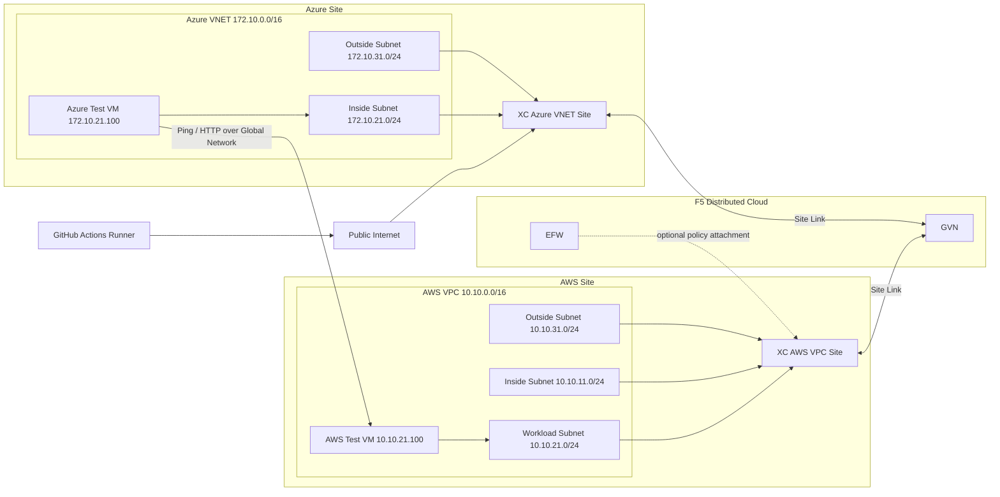

# Teachable 01-mcn-networkconnect Apply

Este documento describe el workflow de GitHub Actions:

- `.github/workflows/teachable-01-mcn-networkconnect-apply.yaml`

Su objetivo es desplegar y validar escenarios del laboratorio **01-mcn-networkconnect** (AWS, Azure, Global Network y Enhanced Firewall) usando Terraform Cloud y credenciales de XC/AWS/Azure.

## Objetivo del workflow

El workflow orquesta, según la lección seleccionada:

1. Aplicación de variables de entorno para el laboratorio.
2. Aprovisionamiento de networking y credenciales cloud.
3. Creación/actualización de sitios (AWS VPC Site / Azure VNET Site).
4. Configuración de conectividad global entre sitios.
5. Validaciones de conectividad (SSH, ping y HTTP).
6. (Opcional) Aplicación y prueba de reglas de Enhanced Firewall.

## Triggers

- `workflow_dispatch`
  - Permite ejecución manual desde GitHub.
  - Inputs:
    - `lesson` (choice):
      - `azure-vnet-site`
      - `aws-vpc-site`
      - `global-network`
      - `enhanced-firewall`
    - `TF_VAR_prefix` (string, opcional)

- `workflow_call`
  - Permite invocación desde otros workflows.
  - Inputs:
    - `lesson`
    - `TF_VAR_prefix` (opcional)

## Secretos requeridos

### Terraform / XC

- `TF_CLOUD_ORGANIZATION`
- `TF_API_TOKEN`
- `XC_API_URL`
- `XC_P12_PASSWORD`
- `XC_API_P12_FILE`

### AWS

- `AWS_ACCESS_KEY`
- `AWS_SECRET_KEY`
- `AWS_SESSION_TOKEN`
- `XC_AWS_CLOUD_CREDENTIALS_NAME`

### Azure

- `AZURE_SUBSCRIPTION_ID`
- `AZURE_TENANT_ID`
- `AZURE_CLIENT_ID`
- `AZURE_CLIENT_SECRET`
- `XC_AZURE_CLOUD_CREDENTIALS_NAME`

## Jobs principales

- `apply_variables`
  - Aplica variables base y exporta outputs para jobs dependientes.

- `aws_credentials`, `aws_networking`, `aws_vpc_site`
  - Flujo para aprovisionamiento en AWS.

- `azure_credentials`, `azure_networking`, `azure_vnet_site`
  - Flujo para aprovisionamiento en Azure.

- `global_network`
  - Ejecuta Terraform para conectar dominios/sitios y expone outputs de conectividad:
    - `ssh_private_key`
    - `ssh_host`
    - `ssh_port`
    - IPs privadas de VMs, entre otros.

- `azure_global_network`, `aws_global_network`
  - Reaplica sitios con conexión al Global Network.

- `test_connection`
  - Valida conectividad extremo a extremo usando SSH hacia host de prueba y luego:
    - `ping` a VM privada AWS.
    - `curl` HTTP hacia endpoint de prueba.

- `xc_enhanced_firewall_rules`, `aws_enhanced_firewall`, `test_enhanched_firewall`
  - Solo para `lesson: enhanced-firewall`.
  - Aplica reglas de firewall y valida impacto en conectividad.

## Arquitectura desplegada por el workflow



### Rol de las subredes en la topología

| Subred                  | Propósito principal                                               | Uso en este laboratorio                                                          |
| ----------------------- | ----------------------------------------------------------------- | -------------------------------------------------------------------------------- |
| `outside subnet`        | Lado WAN/upstream del sitio XC (salida/entrada hacia red externa) | Permite que el CE establezca conectividad con XC y transporte enlaces del sitio. |
| `inside subnet`         | Lado LAN/downstream del sitio XC                                  | Conecta el CE con la red interna del entorno (rutas privadas).                   |
| `workload subnet` (AWS) | Segmento de cargas de aplicación                                  | Aloja la VM de prueba `10.10.21.100` usada para ping/HTTP desde Azure.           |

En resumen: **outside = borde externo**, **inside = borde interno**, **workload = apps**.

## Mejoras de robustez SSH incorporadas

En los jobs de prueba (`test_connection` y `test_enhanched_firewall`) se agregaron controles para reducir fallos intermitentes:

1. Decodificación segura de llave con `printf` + `base64 --decode`.
2. Validación de llave privada con `ssh-keygen -y -f`.
3. Reintentos de SSH (12 intentos, espera de 10 segundos).
4. Diagnóstico detallado (`-vvv`) solo en el último intento.

Esto ayuda especialmente cuando el endpoint SSH todavía no está listo al primer intento y evita fallos tempranos con `exit code 255`.

## Pruebas manuales desde laptop

Una vez que el workflow haya terminado correctamente en lección `global-network`, puedes replicar las mismas pruebas que ejecuta el job `test_connection` desde tu laptop.

### Pre-requisitos

- Haber configurado el secreto `SSH_PRIVATE_KEY` en GitHub (la misma llave se usa para provisionar las VMs).
- Tener los valores de `ssh_host` y `ssh_port` del job `global_network` (se imprimen en el log del step **Print output vars**).
- Tu llave privada local (la que corresponde a `SSH_PRIVATE_KEY`):

```bash
SSH_KEY=~/.ssh/mcn_lab        # ruta a tu llave privada
SSH_HOST="<valor de ssh_host>" # ej: ves-io-xxxx.ac.vh.ves.io
SSH_PORT="<valor de ssh_port>" # ej: 9322
AWS_VM_IP="10.10.21.100"       # IP privada de la VM en AWS
```

### 1. Verificar que la llave es válida

```bash
ssh-keygen -y -f "$SSH_KEY"
```

Debe devolver la clave pública. Si falla, la llave no coincide con la usada en el deploy.

### 2. Test de conectividad SSH (jump host Azure → runner)

```bash
ssh -i "$SSH_KEY" \
    -p "$SSH_PORT" \
    -o ConnectTimeout=10 \
    -o StrictHostKeyChecking=no \
    ubuntu@"$SSH_HOST" \
    "echo 'SSH connection successful.'"
```

### 3. Test de Ping (Azure VM → AWS VM via Global Network)

```bash
ssh -i "$SSH_KEY" \
    -p "$SSH_PORT" \
    -o StrictHostKeyChecking=no \
    ubuntu@"$SSH_HOST" \
    "ping -c 4 -W 10 -v $AWS_VM_IP"
```

> **Nota:** 100% packet loss en el ping no es bloqueante — ICMP puede estar restringido por security group. El test real es HTTP.

### 4. Test HTTP (Azure VM → AWS VM via Global Network)

```bash
ssh -i "$SSH_KEY" \
    -p "$SSH_PORT" \
    -o StrictHostKeyChecking=no \
    ubuntu@"$SSH_HOST" \
    "curl -s -D - http://$AWS_VM_IP/test"
```

Una respuesta HTTP `200 OK` confirma que la conectividad MCN Azure↔AWS está operativa.

### 5. Script completo

```bash
#!/usr/bin/env bash
set -euo pipefail

SSH_KEY=~/.ssh/mcn_lab
SSH_HOST="<ssh_host del output>"
SSH_PORT="<ssh_port del output>"
AWS_VM_IP="10.10.21.100"

SSH_OPTS=(-i "$SSH_KEY" -p "$SSH_PORT" -o ConnectTimeout=10 -o StrictHostKeyChecking=no -o UserKnownHostsFile=/dev/null)

echo "=== SSH Test ==="
ssh "${SSH_OPTS[@]}" ubuntu@"$SSH_HOST" "echo 'SSH OK'"

echo "=== Ping Test ==="
ssh "${SSH_OPTS[@]}" ubuntu@"$SSH_HOST" "ping -c 4 -W 10 $AWS_VM_IP" || echo "Ping failed (may be blocked by SG)"

echo "=== HTTP Test ==="
ssh "${SSH_OPTS[@]}" ubuntu@"$SSH_HOST" "curl -s -D - http://$AWS_VM_IP/test"
```

### Obtener ssh_host y ssh_port

Los valores se muestran en el log del step **Print output vars** del job `global_network`:

```
ssh_host: ves-io-xxxxxxxx-xxxx-xxxx-xxxx-xxxxxxxxxxxx.ac.vh.ves.io
ssh_port: XXXXX
```

También disponibles como outputs del job en la sección **Summary** del workflow run.

## Ejecución manual

1. Ir a **Actions** en GitHub.
2. Seleccionar workflow: **Teachable 01-mcn-networkconnect Apply**.
3. Ejecutar con **Run workflow**.
4. Elegir `lesson` según escenario.
5. (Opcional) definir `TF_VAR_prefix`.

## Criterios de éxito

- Los jobs de aprovisionamiento terminan en estado `success`.
- En `test_connection`:
  - SSH inicial exitoso.
  - Ping al target privado exitoso (o comportamiento esperado en pruebas de firewall).
  - Respuesta HTTP del endpoint de prueba.

## Troubleshooting rápido

- **Error de SSH (255 / connection closed):**
  - Revisar logs del último intento (`-vvv`).
  - Verificar que `ssh_host` y `ssh_port` de outputs sean correctos.
  - Confirmar que la VM/bastion esté activa y con acceso permitido.

- **Fallas de Terraform init/apply:**
  - Validar `TF_API_TOKEN`, `TF_CLOUD_ORGANIZATION` y nombre de workspace.
  - Confirmar que el secreto `XC_API_P12_FILE` esté correctamente codificado en base64.

- **Fallas de acceso cloud:**
  - Revisar expiración/permisos de credenciales AWS y Azure.

## Ruta del archivo del workflow

- `.github/workflows/teachable-01-mcn-networkconnect-apply.yaml`
