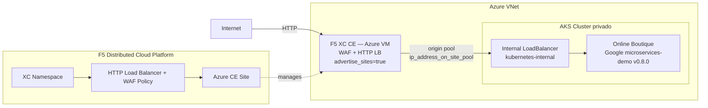

# WAF on CE Azure — Apply

Este workflow despliega una solución de **Web Application Firewall (WAF) con F5 Distributed Cloud sobre un Customer Edge (CE) en Azure**. El tráfico de internet es inspeccionado por F5 XC antes de llegar a la aplicación Online Boutique corriendo en un clúster AKS privado.

---

## Resumen de arquitectura y caso de uso

### ¿Para qué sirve este laboratorio?

| Capacidad                      | Descripción                                                                                 |
| ------------------------------ | ------------------------------------------------------------------------------------------- |
| WAF en CE                      | F5 XC actúa como WAF sobre el Customer Edge en Azure, sin pasar por Regional Edge (RE).     |
| Protección de aplicaciones AKS | La aplicación Online Boutique corre en AKS con Load Balancer interno (no expuesto directo). |
| Tráfico HTTP-only              | El LB de F5 XC se configura en modo HTTP solamente (no requiere certificado ACME).          |
| Infraestructura efímera        | Todo se provisiona desde cero con Terraform y se destruye con el workflow de destroy.       |
| Estado remoto compartido       | Los tres workspaces de TFC comparten estado remoto para pasar outputs entre módulos.        |

### Arquitectura conceptual

```
Internet
   │
   │  HTTP request
   ▼
┌──────────────────────────────────────────────────────┐
│                  Azure VNet                           │
│                                                       │
│  ┌─────────────────────────────────────────────────┐  │
│  │  F5 XC Customer Edge (CE) — Azure VM            │  │
│  │                                                  │  │
│  │  • WAF inspection                               │  │
│  │  • HTTP Load Balancer                           │  │
│  │  • advertise_sites = true                       │  │
│  └────────────────────┬────────────────────────────┘  │
│                       │                               │
│                       │  Forward (origin pool)        │
│                       ▼                               │
│  ┌─────────────────────────────────────────────────┐  │
│  │  AKS Cluster (private)                          │  │
│  │                                                  │  │
│  │  Internal LoadBalancer (kubernetes-internal)    │  │
│  │       │                                         │  │
│  │       ▼                                         │  │
│  │  Online Boutique (Google microservices-demo)    │  │
│  └─────────────────────────────────────────────────┘  │
└──────────────────────────────────────────────────────┘
```

### Casos de uso típicos

1. Demostración de WAF on CE sin necesidad de dominio público ni certificado TLS.
2. Laboratorio de protección de aplicaciones containerizadas en AKS con F5 XC.
3. Validación de políticas WAF de F5 XC sobre tráfico a microservicios.
4. Entorno de pruebas efímero para workshops y capacitaciones de F5 Distributed Cloud.

### Componentes desplegados

```
azure/azure-infra  ──►  VNet + Subnets + Security Groups (Azure)
        │
        ▼
azure/aks-cluster  ──►  AKS Cluster + Online Boutique (manifest.yaml)
        │                      CE WAAP VM (via XC Terraform provider)
        ▼
xc/                ──►  XC Namespace + Azure CE Site + HTTP LB + WAF Policy
```

---

## Objetivo del workflow

1. Crear (o verificar) los tres workspaces de Terraform Cloud con modo de ejecución `local` y Remote State Sharing habilitado entre ellos.
2. Aprovisionar la infraestructura de red en Azure: VNet, subredes y los recursos de soporte (security groups, etc.).
3. Desplegar el clúster AKS privado con la aplicación **Online Boutique** (Helm/manifest) y el CE WAF VM.
4. Configurar en F5 Distributed Cloud el CE Site de Azure, el HTTP Load Balancer con WAF policy, y el namespace de la aplicación.

---

## Triggers

```yaml
on:
  workflow_dispatch:
```

Se ejecuta manualmente desde la pestaña **Actions** de GitHub. No tiene inputs opcionales; toda la configuración proviene de secretos y variables del repositorio.

---

## Secretos requeridos

Configurar en **Settings → Secrets and variables → Secrets**:

### Terraform Cloud

| Secreto                 | Descripción                                  |
| ----------------------- | -------------------------------------------- |
| `TF_API_TOKEN`          | Token de API de Terraform Cloud              |
| `TF_CLOUD_ORGANIZATION` | Nombre de la organización en Terraform Cloud |

### Azure

| Secreto                 | Descripción                             |
| ----------------------- | --------------------------------------- |
| `AZURE_SUBSCRIPTION_ID` | ID de la suscripción de Azure           |
| `AZURE_TENANT_ID`       | ID del tenant de Azure Active Directory |
| `AZURE_CLIENT_ID`       | App ID del Service Principal de Azure   |
| `AZURE_CLIENT_SECRET`   | Password del Service Principal de Azure |

### F5 Distributed Cloud

| Secreto           | Descripción                                                             |
| ----------------- | ----------------------------------------------------------------------- |
| `XC_TENANT`       | Nombre del tenant de F5 XC (sin `.console.ves.volterra.io`)             |
| `XC_API_URL`      | URL de la API de F5 XC (`https://<tenant>.console.ves.volterra.io/api`) |
| `XC_P12_PASSWORD` | Contraseña del certificado `.p12` de F5 XC                              |
| `XC_API_P12_FILE` | Certificado API de F5 XC en formato `.p12` codificado en **base64**     |

### SSH

| Secreto           | Descripción                                                                                 |
| ----------------- | ------------------------------------------------------------------------------------------- |
| `SSH_PRIVATE_KEY` | Llave privada SSH (la pública se deriva en runtime con `ssh-keygen -y`). Usada en el CE VM. |

---

## Variables requeridas

Configurar en **Settings → Secrets and variables → Variables**:

### Terraform Cloud — Workspaces

| Variable                         | Ejemplo           | Descripción                                  |
| -------------------------------- | ----------------- | -------------------------------------------- |
| `TF_CLOUD_WORKSPACE_AZURE_INFRA` | `waf-ce-az-infra` | Nombre del workspace de TFC para Azure Infra |
| `TF_CLOUD_WORKSPACE_AKS_CLUSTER` | `waf-ce-az-aks`   | Nombre del workspace de TFC para AKS Cluster |
| `TF_CLOUD_WORKSPACE_XC_DEPLOY`   | `waf-ce-az-xc`    | Nombre del workspace de TFC para F5 XC       |

### Infraestructura

| Variable         | Ejemplo  | Descripción                                      |
| ---------------- | -------- | ------------------------------------------------ |
| `AZURE_REGION`   | `eastus` | Región de Azure donde se despliegan los recursos |
| `PROJECT_PREFIX` | `waf-ce` | Prefijo para nombrar todos los recursos creados  |

### Aplicación

| Variable       | Ejemplo                | Descripción                                  |
| -------------- | ---------------------- | -------------------------------------------- |
| `XC_NAMESPACE` | `boutique-prod`        | Namespace de F5 XC donde se crea el LB y WAF |
| `APP_DOMAIN`   | `boutique.example.com` | FQDN de la aplicación en el HTTP LB de F5 XC |

---

## Jobs principales

### `setup_tfc_workspaces`

Crea o actualiza los tres workspaces en Terraform Cloud vía la API REST:

- Execution Mode: **local** (el runner de GitHub ejecuta Terraform).
- Remote State Sharing: habilitado entre los tres workspaces.
  - `azure-infra` comparte estado con `aks-cluster` y `xc-deploy`.
  - `aks-cluster` comparte estado con `xc-deploy`.

### `terraform_infra` — Azure Infra

- **Módulo:** `azure/azure-infra`
- **Workspace TFC:** `TF_CLOUD_WORKSPACE_AZURE_INFRA`
- **Qué crea:**
  - Virtual Network de Azure con subredes (outside, inside, workload).
  - Network Security Groups y reglas de acceso.
  - Recursos de soporte necesarios para CE y AKS.
- **Configuración especial:** escribe `github.auto.tfvars` con `aks-cluster = true` para habilitar solo los recursos necesarios para este laboratorio.

### `terraform_aks` — Azure AKS

- **Módulo:** `azure/aks-cluster`
- **Workspace TFC:** `TF_CLOUD_WORKSPACE_AKS_CLUSTER`
- **Qué crea:**
  - Clúster AKS privado.
  - Deployment de la aplicación **Online Boutique** via `manifest.yaml`.
  - Servicio `frontend` como `LoadBalancer` interno (`azure-load-balancer-internal: "true"`).
  - Ce WAAP VM (Customer Edge de F5 XC dentro del AKS VNet).
- **Nota:** usa estado remoto de `azure-infra` para obtener IDs de red.

### `terraform_xc_lb` — F5XC WAF

- **Módulo:** `xc/`
- **Workspace TFC:** `TF_CLOUD_WORKSPACE_XC_DEPLOY`
- **Qué crea / configura:**
  - Namespace de F5 XC (creado vía API curl antes de Terraform si no existe).
  - Azure CE Site (modo `az_ce_site = true`).
  - HTTP Load Balancer con WAF policy (HTTP only, sin TLS).
  - Origin Pool apuntando al Internal LB del AKS (`ip_address_on_site_pool = true`).
  - Advertise en el sitio CE (`advertise_sites = true`).
- **Parámetros fijos en el job:**

  | Variable Terraform               | Valor  | Propósito                                     |
  | -------------------------------- | ------ | --------------------------------------------- |
  | `TF_VAR_az_ce_site`              | `true` | Registra el CE como Azure CE Site en F5 XC    |
  | `TF_VAR_advertise_sites`         | `true` | Publica el LB en el CE (no en RE)             |
  | `TF_VAR_ip_address_on_site_pool` | `true` | Usa IP directa del AKS LB en el origin pool   |
  | `TF_VAR_http_only`               | `true` | HTTP solamente (no requiere certificado ACME) |

- **Pre-step especial:** extrae cert/key del `.p12` con `openssl pkcs12 -legacy` para crear el namespace vía curl si no existe (respuestas `200` y `409` son aceptadas).

---

## Arquitectura desplegada por el workflow



---

## Troubleshooting rápido

- **Error `hostname not in correct format` en `setup_tfc_workspaces`:**
  Verificar que el secreto `TF_CLOUD_ORGANIZATION` esté correctamente configurado y no esté vacío.

- **Error `exit code 58` o falla en extracción de cert/key del P12:**
  Confirmar que `XC_API_P12_FILE` esté codificado en base64 correctamente:

  ```bash
  base64 -i api.p12 | pbcopy   # macOS
  base64 api.p12 | xclip       # Linux
  ```

  Si el P12 fue generado con OpenSSL 3.x, el flag `-legacy` ya está incluido en el workflow.

- **Error 404 al crear namespace XC:**
  El body del POST usa `"namespace":""` (vacío). Confirmar la URL base de la API: debe terminar en `/api`, y el step le quita ese sufijo antes de usarla.

- **`data.azurerm_lb.lb` falla durante `terraform plan` (AKS):**
  El data source del LB depende del clúster AKS. El workflow usa `replace_triggered_by` y `depends_on` para garantizar el orden. Si ocurre en un re-run manual, verificar que el workspace de `azure-infra` tenga estado válido.

- **Error 409 al destruir `volterra_cloud_credentials`:**
  F5 XC elimina el Azure VNET Site de forma asíncrona. El recurso `volterra_cloud_credentials` tiene un `destroy provisioner` con `sleep 90` para esperar. Si persiste, ejecutar el destroy nuevamente.

- **AKS LB tarda en adquirir IP:**
  El paso de `time_sleep` aguarda 90 segundos después del deploy del manifest. En regiones con carga alta puede necesitar más tiempo.

---

## Ejecución manual

1. Ir a **Actions** en GitHub.
2. Seleccionar el workflow: **F5XC WAF on CE Deploy**.
3. Hacer clic en **Run workflow**.
4. Confirmar la ejecución. No hay inputs adicionales.

### Criterios de éxito

- Los cuatro jobs terminan en estado `success`.
- El namespace indicado en `XC_NAMESPACE` existe en la consola de F5 XC.
- El HTTP Load Balancer aparece publicado en el Azure CE Site.
- La aplicación Online Boutique es accesible desde internet a través del dominio configurado en `APP_DOMAIN`.

---

## Destroy del laboratorio

### Workflow de destroy

El archivo `.github/workflows/waf-on-ce-az-destroy.yml` destruye **todos** los recursos creados por el apply en orden inverso para evitar dependencias huérfanas en F5 XC y Azure.

**Trigger:** `workflow_dispatch` — ejecución manual desde GitHub Actions.

### Orden de destrucción

```
terraform_xc_lb   (1° — elimina LB, WAF policy, CE Site, namespace)
      │
      ▼
terraform_aks     (2° — elimina AKS, Online Boutique, CE WAAP VM)
      │
      ▼
terraform_infra   (3° — elimina VNet, subnets, NSGs en Azure)
```

> **Por qué XC se destruye primero:** el CE Site tiene referencias al VNet de Azure. Si se intenta destruir el VNet antes de que F5 XC haya desregistrado el CE, Azure devuelve error porque las NICs del CE aún están en uso. Además, `volterra_cloud_credentials` tiene un `destroy provisioner` con `sleep 90` para que Azure finalice la limpieza del CE antes de intentar eliminar las credenciales.

### Jobs del workflow de destroy

| Job               | Terraform workspace              | Qué elimina                                              |
| ----------------- | -------------------------------- | -------------------------------------------------------- |
| `terraform_xc_lb` | `TF_CLOUD_WORKSPACE_XC_DEPLOY`   | HTTP LB, WAF policy, CE Site, XC Namespace (best-effort) |
| `terraform_aks`   | `TF_CLOUD_WORKSPACE_AKS_CLUSTER` | AKS Cluster, Online Boutique, CE WAAP VM                 |
| `terraform_infra` | `TF_CLOUD_WORKSPACE_AZURE_INFRA` | VNet, subnets, NSGs y recursos de red en Azure           |

### Troubleshooting del destroy

- **Error 409 al destruir `volterra_cloud_credentials` — `still being referred by 1 objects`:**
  El VNET Site aún no terminó de desaprovisionarse en F5 XC. El `sleep 90` del destroy provisioner cubre la mayoría de los casos. Si persiste, esperar 2-3 minutos y relanzar el destroy.

- **Error `InUseSubnetCannotBeDeleted` al destruir la VNet:**
  Las NICs del CE son creadas por F5 XC en Azure y pueden tardar en limpiarse después de que el VNET Site ya fue eliminado en la plataforma XC. Esperar unos minutos y relanzar `terraform_infra`.

- **Error 403 al eliminar el namespace XC:**
  El step de eliminación del namespace tiene `continue-on-error: true`. Puedes eliminarlo manualmente desde la consola de F5 XC si es necesario.

---

## Ruta de los archivos del workflow

- `.github/workflows/waf-on-ce-az-apply.yml`
- `.github/workflows/waf-on-ce-az-destroy.yml`
